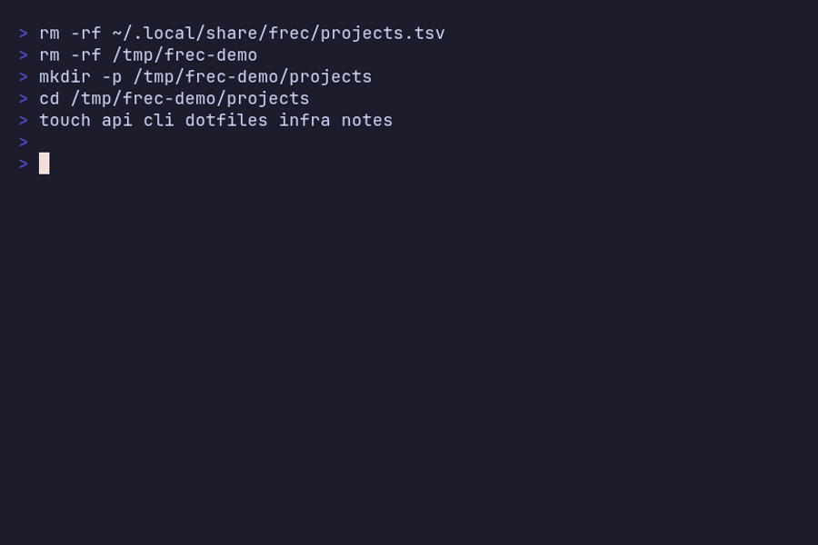

# frec

Frecency-based item tracker — ranks items by how often and how recently you use them.

Built to power pickers and menus that should reorder based on actual usage, like a tmux sessionizer.



## Install

**With Go:**
```bash
go install github.com/shv-ng/frec@latest
```

**Without Go:** grab the binary for your platform from the [releases page](https://github.com/shv-ng/frec/releases).

## How It Works

Each item has a score based on visit frequency and recency. Recent visits weigh more than old ones. The score decays over time if you stop using something.

```
score = (count × avg_weight × 100) / days_since_first_seen
```

Weight by recency: `0–4d → 1.0`, `5–14d → 0.7`, `15–31d → 0.5`, `32–90d → 0.3`, `90d+ → 0.1`

Starred items get 2× score.

## Usage

```
frec add <namespace> <item>        # Record a visit
frec list <namespace>              # List items sorted by score
frec remove <namespace> <item>     # Remove an item
frec star <namespace> <item>       # Star an item
frec unstar <namespace> <item>
frec sync <namespace>              # Replace namespace contents from stdin
frec namespace list                # List all namespaces
frec namespace remove <namespace>
```

### List Flags

```
--format      Output format string (default: "${name}\t${star}\tscore:${score}\tvisits:${count}\tlast:${lastseen}d ago\n")
--limit N     Top N items only
--since N     Only items visited in last N days
--starred     Only starred items
```

Format tokens: `${name}`, `${star}`, `${score}`, `${count}`, `${firstseen}`, `${lastseen}`

### Sync

`sync` replaces the namespace with items from stdin, preserving existing metadata (score, visits, starred) for items that already exist. New items start fresh.

```bash
ls ~/projects | frec sync projects
find ~/work -maxdepth 1 -type d | frec sync dirs
```

Use `--null` if your input is null-separated (e.g. `find -print0`):

```bash
find ~/projects -maxdepth 1 -type d -print0 | frec sync --null projects
```

## Data

Stored in `$XDG_DATA_HOME/frec` (default: `~/.local/share/frec`), one `.tsv` file per namespace.

---

If frec is useful to you, consider giving it a ⭐ — it helps others find it.

Built with ❤️ by [shv-ng](https://github.com/shv-ng).
